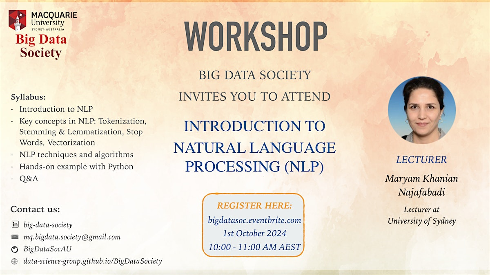

# Introduction to NLP

  

This repository contains the Python notebook for the "Introduction to NLP" workshop led by Dr. Maryam Khanian Najafabadi from the University of Sydney.

To use the tutorial you can just download them or from the file directly open them in colab to execute. Happy Coding!

